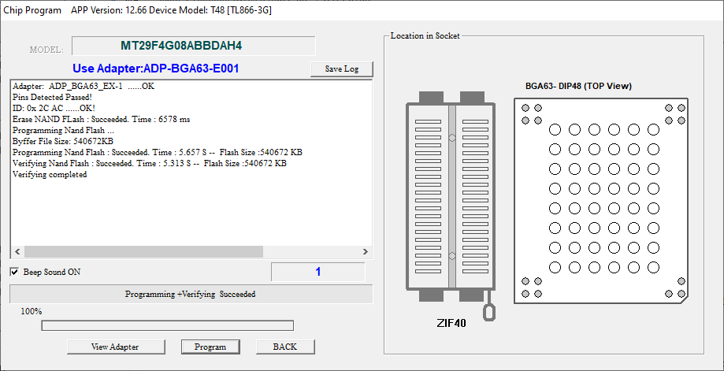

# OP-1 Rescue (WIP)

This is a "research" project that I am doing in hopes of rescuing my OP-1 that is currently bricked.

## Problem

My OP-1 (OG Rev2) turns on, but displays this error message:

> Missing content folder.  
> Please reinstall OS.

This can be a common and easy to fix issue, with the solution being to just flash the OP-1 with new firmware over USB. The only issue is that my OP-1 is not recognized by any computer that it is connected to.
### Symptoms

- Can't connect to computer (MacOS & Windows)

- Enters [te-boot](https://teenage.engineering/guides/op-1/original/te-boot) (bootloader/diagnostic menu)

- Charges over USB

- Passes all other functionality tests
### Troubleshooting

- Used different cables

- Tried multiple computers

- Replaced connector board

I have determined that it is probably a software issue that is preventing the OP-1 from being able function as a mountable disk.

So here is the problem; I'm obviously unable to upload any new firmware if I can't connect to the device via USB in the first place.
## Solution

My plan is to remove the BGA flash chip from the DSP board, flash it with a clean backup, then reinstall the chip onto the DSP board.
## Progress

So far, I have removed the flash storage, and was able to reflash it with a clean backup with the firmware preinstalled.

## Acknowledgements

 - [op1dumps](https://github.com/Tolsi/op1dumps)